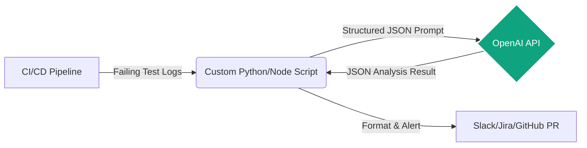
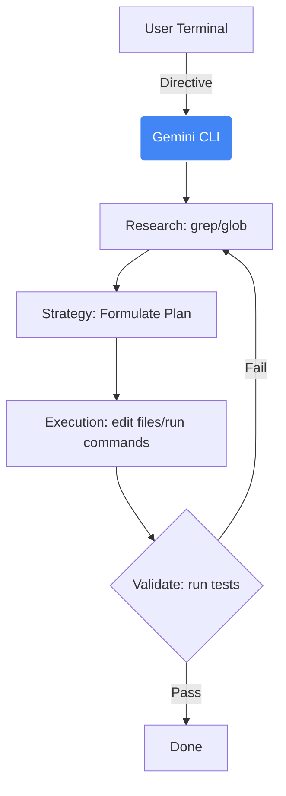
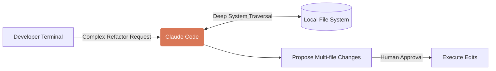
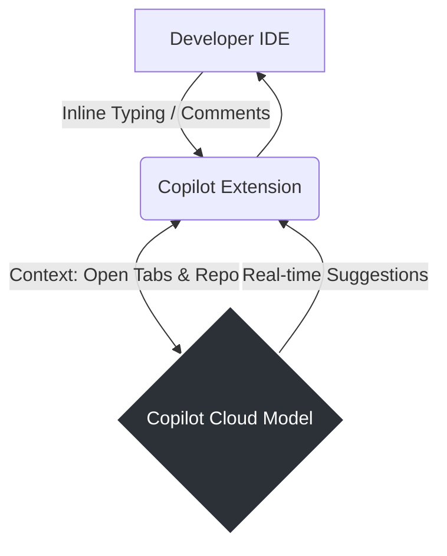
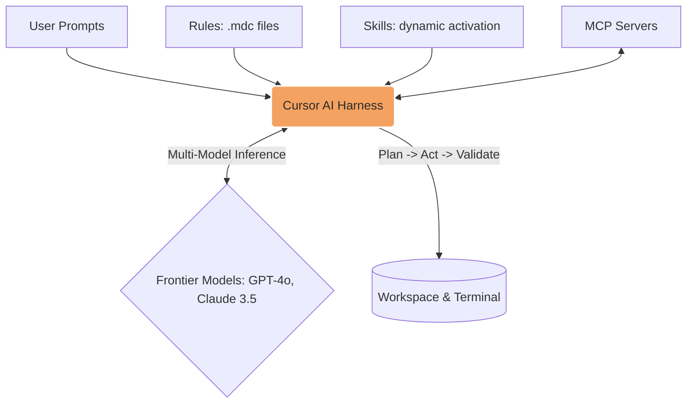

# AI-Augmented QA & SDET Engineering Guidelines

**Author:** Principal AI Engineer & Lead Test Architect
**Version:** 1.1.0
**Target Audience:** QA Engineers, SDETs, DevOps Engineers

This repository establishes the foundational design patterns, prompt engineering constraints, and configuration standards for integrating Large Language Models (LLMs) and autonomous coding agents into our software testing ecosystem. As AI capabilities become intrinsic to our CI/CD pipelines and framework architectures, these unified practices ensure scalable, robust, and secure implementations.

---

## Foundations: Agents, MCPs, and Agentic Workflows

Before diving into specific platforms, it's crucial to understand the foundational concepts powering this shift in software engineering and testing:

### 1. What is an AI Agent?
An **AI Agent** is an autonomous system driven by a Large Language Model (LLM) that goes beyond simple chat completions. Agents can:
- **Perceive:** Read files, analyze logs, and understand workspace context.
- **Plan:** Break down complex tasks into manageable steps (Research -> Strategy -> Execution).
- **Act:** Execute shell commands, write code, run tests, and interact with external APIs.
- **Learn/Correct:** Analyze the results of their actions (e.g., test failures) and self-correct their approach.

### 2. What are Agentic Workflows?
**Agentic Workflows** refer to the structured patterns in which we deploy AI agents to achieve reliable, iterative results rather than relying on one-shot prompts. Key workflow patterns include:
- **Reflection:** The agent reviews its own code or test plan before execution.
- **Tool Use:** The agent dynamically selects the right tool (e.g., `grep` for search, `npx playwright` for testing) to accomplish a task.
- **Planning:** The agent creates a multi-step plan and asks for human approval before making massive codebase changes.
- **Multi-Agent Collaboration:** Different specialized agents (e.g., a "Code Architect" and a "Test Reviewer") working together to solve a problem.

### 3. Model Context Protocol (MCP)
The **Model Context Protocol (MCP)** is an open standard that allows AI agents to securely connect to local and remote data sources or tools. Instead of hardcoding integrations into every LLM, MCP provides a universal interface.
- **Servers:** Expose specific capabilities (e.g., a Playwright MCP server to run tests, a GitHub MCP server to read PRs, a Postgres MCP server to query test data).
- **Clients:** AI IDEs (like Cursor) or agents (like Claude Desktop) act as clients that can seamlessly invoke these servers to expand their context and capabilities dynamically.

---

## 1. Comparative Matrix: Best QA/SDET Use Cases

| Provider / Platform | Primary Architecture | Best QA / SDET Use Case | Strengths in Testing Ecosystem |
| :--- | :--- | :--- | :--- |
| **OpenAI Codex (API/Custom Agents)** | API Integration / Custom Microservices | Automated Bug Triaging & Massive Log Analysis | High reasoning capabilities for parsing complex stack traces, zero-shot test generation via CI scripts. |
| **Gemini CLI** | Interactive Terminal Agent | CI/CD Pipeline Augmentation & Scripting | Seamless shell execution, local environment context mapping, rapid test script scaffolding. |
| **Claude Code** | Terminal-native Agent | Framework Architecture & Refactoring | Deep contextual understanding of large codebases, excellent for migrating test frameworks (e.g., Selenium to Playwright). |
| **GitHub Copilot** | IDE Integration & PR Review | Real-time Test Authoring & PR Validation | Inline code completion for unit/e2e tests, generating test cases based on implementation diffs. |
| **Cursor** | AI-First IDE | Zero-to-One Framework Scaffolding & Agentic QA Workflows | Multi-file generation, deep codebase indexing, parallel agents in worktrees, Skills for specialized SDET workflows, MCP integrations (Playwright, Sentry), Plan Mode for complex migrations. Ideal for new Playwright/Java/JS repositories and iterative test-driven development. |

---

## 2. Master Documentation Index

- [AI-Augmented QA \& SDET Engineering Guidelines](#ai-augmented-qa--sdet-engineering-guidelines)
  - [1. Comparative Matrix: Best QA/SDET Use Cases](#1-comparative-matrix-best-qasdet-use-cases)
  - [2. Master Documentation Index](#2-master-documentation-index)
  - [3. Architectural Principles for AI in QA](#3-architectural-principles-for-ai-in-qa)
  - [4. Platform-Specific Guidelines \& Templates](#4-platform-specific-guidelines--templates)
    - [4.1 OpenAI (API/Codex)](#41-openai-apicodex)
    - [4.2 Gemini CLI](#42-gemini-cli)
      - [4.2.1 Core Agentic Flows](#421-core-agentic-flows)
      - [4.2.2 Sub-Agents \& Tools](#422-sub-agents--tools)
      - [4.2.3 Specializing Gemini Agents (Skills)](#423-specializing-gemini-agents-skills)
    - [4.3 Claude Code](#43-claude-code)
    - [4.4 GitHub Copilot](#44-github-copilot)
    - [4.5 Cursor](#45-cursor)
      - [4.5.1 Rules System \& Hierarchy](#451-rules-system--hierarchy)
      - [4.5.2 Modern Rules Format (`.mdc`)](#452-modern-rules-format-mdc)
      - [4.5.3 AGENTS.md Alternative](#453-agentsmd-alternative)
      - [4.5.4 Operating with Multiple Agents](#454-operating-with-multiple-agents)
      - [4.5.5 Specializing Cursor Agents (Skills)](#455-specializing-cursor-agents-skills)
      - [4.5.6 Plan Mode \& Agent Best Practices](#456-plan-mode--agent-best-practices)
      - [4.5.7 MCP Integrations for QA](#457-mcp-integrations-for-qa)
      - [4.5.8 Cursor Ignore](#458-cursor-ignore)
      - [4.5.9 Legacy `.cursorrules` (Deprecated)](#459-legacy-cursorrules-deprecated)
  - [5. Pipeline Integration Patterns](#5-pipeline-integration-patterns)
  - [6. References](#6-references)
    - [Cursor-Specific Resources](#cursor-specific-resources)

---

## 3. Architectural Principles for AI in QA

- **Determinism in Verification:** AI must *generate* or *analyze* tests, but the execution and assertion mechanisms must remain deterministic. Never use LLMs to dynamically determine test pass/fail status without a hardcoded fallback assertion.
- **Context Bounding:** Limit the scope of context provided to agents. Provide only relevant Page Objects, API contracts, or specific test execution logs to prevent hallucinations.
- **Idempotency:** Generated test scripts must be idempotent. Prompt architectures must explicitly enforce the creation of setup/teardown hooks (e.g., `beforeEach`, `afterAll`).
- **Security & Data Privacy:** Never pass production PII or sensitive secrets into prompts or agent context windows. Use anonymized data sets for test generation.

---

## 4. Platform-Specific Guidelines & Templates

### 4.1 OpenAI (API/Codex)

**Design Philosophy:** Treat OpenAI models as stateless inference engines within CI/CD pipelines. Best used via custom Python/Node.js scripts to analyze JUnit/Allure reports or generate test data dynamically.

**Architecture Diagram:**


**Implementation Standard:** Build microservices or script-based agents that query the API with highly structured JSON schemas.

**Template: QA Log Analyzer System Prompt**
*File:* `prompts/log_analyzer.json`

```json
{
  "model": "gpt-4-turbo",
  "temperature": 0.1,
  "response_format": { "type": "json_object" },
  "messages": [
    {
      "role": "system",
      "content": "You are a Lead SDET analyzing CI execution logs. Your task is to extract failure root causes. You MUST respond strictly in the following JSON schema: {\"failure_type\": \"ENVIRONMENT|LOCATOR_CHANGED|TIMEOUT|FLAKY|BUG\", \"root_cause_summary\": \"string\", \"suggested_fix\": \"string\", \"affected_files\": [\"string\"]}. Do not include markdown formatting or explanations outside the JSON payload."
    }
  ]
}
```

### 4.2 Gemini CLI

**Design Philosophy:** Gemini CLI acts as your autonomous shell companion. Use it for complex environment setups, rapid test execution via bash, dynamic scaffolding of test suites directly from the terminal, and orchestrating testing architectures using its robust Research -> Strategy -> Execution loop.

**Architecture Diagram:**


**Implementation Standard:** Leverage `.geminiignore` to protect sensitive test data and configuration files from being read. Utilize foundational `GEMINI.md` files to set workspace-wide testing mandates.

#### 4.2.1 Core Agentic Flows

Gemini CLI operates on a strict engineering methodology that SDETs should leverage:

1. **Research Phase:** Tell the CLI to map the test architecture using `grep_search` and `glob`.
2. **Strategy Phase:** The CLI formulates an execution plan (e.g., refactoring test fixtures) before touching code.
3. **Execution Phase (Plan -> Act -> Validate):** Ensures that code modifications include tests, are executed natively in the terminal (e.g., `npx playwright test`), and verified against failure states before finishing.

**Template: Workspace Mandate**
*File:* `GEMINI.md`

```markdown
# QA Workspace Mandates for Gemini CLI

1. **Test Framework:** All new web tests must use Playwright with TypeScript.
2. **Design Pattern:** Strictly adhere to the Page Object Model (POM). Locators must be defined using `page.getByRole()` or `page.getByTestId()` where possible.
3. **Assertions:** Use Playwright's auto-retrying web-first assertions (e.g., `expect(locator).toBeVisible()`). Never use hard `page.waitForTimeout()` sleeps.
4. **Execution:** Before suggesting a code change is complete, you MUST run `npx playwright test <changed_file>` via your `run_shell_command` tool and verify it passes. Never commit untested test specs.
```

**Template: Ignore File**
*File:* `.geminiignore`

```text
# Exclude test artifacts and secrets
playwright-report/
test-results/
.env.e2e
cypress/videos/
cypress/screenshots/
```

#### 4.2.2 Sub-Agents & Tools

Gemini CLI comes with specialized sub-agents that QA engineers can directly invoke for deeper analysis:
- **`codebase_investigator`**: Delegate root-cause analysis for flaky tests. Example prompt: *"Investigate why the authentication spec is randomly failing in CI and map the state dependencies across the login module."*
- **`run_shell_command`**: Gemini CLI uses bash directly. Use this to spin up local docker containers for integration tests, or clear cache before test executions.

#### 4.2.3 Specializing Gemini Agents (Skills)

You can extend Gemini CLI with custom Skills (similar to Cursor Skills) to enforce specialized SDET workflows. 

**Creating a Skill:**
Use the `activate_skill` tool with the name `skill-creator` to guide Gemini CLI in creating a new QA skill. Or, manually create a directory structure.

**Skill Structure Example:**
```text
.gemini/skills/sdet-playwright/
└── SKILL.md
```

**Template: Gemini SDET Skill**
*File:* `.gemini/skills/sdet-playwright/SKILL.md`
```markdown
<skill_name>sdet-playwright</skill_name>
<description>Guide for creating and refactoring Playwright test specs using the POM standard.</description>

<instructions>
When generating Playwright tests:
1. Research the codebase to locate the target page object models in `/pages`.
2. Ensure you use Playwright fixtures and `page.route` to mock network conditions for stability.
3. Upon completing the script, execute `npx playwright test <file_path>` using `run_shell_command`.
4. If the test fails, do not ask the user for help; instead, read the stdout, analyze the failure, correct the locator or assertion, and retry.
</instructions>
```

### 4.3 Claude Code

**Design Philosophy:** Claude Code excels at understanding the interconnectedness of large framework architectures. Use it for major refactoring tasks, such as migrating from Cypress to Playwright, or auditing test coverage across microservices.

**Architecture Diagram:**


**Implementation Standard:** Interact with Claude Code using clear, multi-step directives. Rely on its ability to read the file system extensively before writing code.

**Template: Migration Directive**
*File:* `docs/claude_migration_directive.md`

```markdown
# Task: Migrate Authentication Specs to Playwright

**Objective:** Migrate existing Cypress tests in `cypress/e2e/auth/` to the new Playwright framework in `tests/e2e/auth/`.

**Constraints:**
1. **Analyze First:** Review `tests/support/auth_helpers.ts` to understand our custom login fixtures in Playwright before writing any tests.
2. **Translation:** Convert Cypress `cy.get()` calls to appropriate Playwright locators. Avoid direct CSS selectors if semantic locators (roles, text) are viable.
3. **State Management:** Ensure Playwright tests utilize `test.use({ storageState: 'state.json' })` for tests that do not require explicit login flows.
4. **Validation:** Do not consider the migration complete until you have executed the new Playwright spec via the terminal and confirmed it passes.
```

### 4.4 GitHub Copilot

**Design Philosophy:** Copilot is the "pair programmer" for the SDET. It is best used for in-editor autocomplete, generating unit tests for specific functions, and drafting PR descriptions.

**Architecture Diagram:**


**Implementation Standard:** Steer Copilot's generation using clear, descriptive comments immediately preceding the target code. Configure repository-level instructions to enforce testing standards.

**Template: Copilot Custom Instructions**
*File:* `.github/copilot-instructions.md`

```markdown
# GitHub Copilot Instructions for SDETs

When generating tests or test-related code in this repository:

- **Language/Framework:** Assume Java 17+ and JUnit 5 for backend tests. Assume TypeScript and Playwright for frontend tests.
- **Naming Conventions:** Test methods must follow the `methodName_stateUnderTest_expectedBehavior` convention (e.g., `login_invalidCredentials_throwsUnauthorizedException`).
- **Structure:** Strictly adhere to the Arrange-Act-Assert (AAA) pattern. Use blank lines to separate the three sections within the test method.
- **Data:** Prefer parameterized tests (`@ParameterizedTest` in JUnit) for testing multiple input variations over writing redundant single-case tests.
- **Mocking:** Use Mockito for Java. Use `page.route()` for Playwright network mocking.
```

### 4.5 Cursor

**Design Philosophy:** Cursor is an AI-first IDE designed for high-velocity creation, large-scale refactoring, and agentic workflows. It is the optimal environment for establishing new test repositories, building complex data-generation utilities, running parallel agents for comparative solutions, and delegating QA tasks to cloud agents. Cursor's harness combines user prompts, tools (file editing, codebase search, terminal execution), and persistent instructions (Rules + Skills) to orchestrate frontier models effectively.

**Architecture Diagram:**


---

#### 4.5.1 Rules System & Hierarchy

Cursor has transitioned from a single `.cursorrules` file (legacy) to the modern `.cursor/rules/` directory system. Use the modern system for fine-grained control.

**Rules Precedence (highest to lowest):**

| Priority | Source | Scope |
|----------|--------|-------|
| 1 | Team Rules | Organization-wide (Team/Enterprise plans) |
| 2 | Project Rules | `.cursor/rules/*.mdc` — version-controlled |
| 3 | User Rules | Cursor Settings > Rules — global preferences |
| 4 | Legacy Rules | `.cursorrules` file — deprecated but supported |
| 5 | AGENTS.md | Simple markdown in project root or subdirectories |

**Implementation Standard:** Prefer `.cursor/rules/*.mdc` for project rules. Use `AGENTS.md` only for simple, always-on instructions without activation controls.

**Quick Reference: Rules vs Skills vs AGENTS.md**

| Mechanism | Use When | Activation |
|-----------|----------|------------|
| **Rules** (`.cursor/rules/*.mdc`) | Project conventions, coding standards, file-specific patterns | Always or when matching globs |
| **Skills** (`.cursor/skills/*/SKILL.md`) | Task-specific workflows, domain knowledge, reusable commands | Dynamic — agent loads when relevant |
| **AGENTS.md** | Simple, always-on instructions; no activation control needed | Always (project root) |

---

#### 4.5.2 Modern Rules Format (`.mdc`)

Rules are markdown files with YAML frontmatter stored in `.cursor/rules/`. Use `.mdc` for activation control.

**Frontmatter Fields:**

| Field | Type | Description |
|-------|------|-------------|
| `description` | string | Brief description (shown in rule picker) |
| `globs` | string | File pattern — rule applies when matching files are open |
| `alwaysApply` | boolean | If `true`, applies to every conversation |

**Example: File-Specific Rule for Playwright Specs**
*File:* `.cursor/rules/playwright-specs.mdc`

```markdown
---
description: Playwright test conventions for spec files
globs: "**/*.spec.ts,**/tests/**/*.ts"
alwaysApply: false
---

# Playwright Spec Standards

- Use `page.getByRole()` or `page.getByTestId()` for locators; avoid raw CSS selectors.
- Use Playwright's auto-retrying assertions: `expect(locator).toBeVisible()`, `.toHaveText()`.
- Never use `page.waitForTimeout()` — use `expect().toBeVisible()` or explicit waits.
- Follow Arrange-Act-Assert with blank lines between sections.
- Run `npx playwright test <file>` before considering changes complete.
```

**Example: Always-Apply Project Standards**
*File:* `.cursor/rules/sdet-architecture.mdc`

```markdown
---
description: Core SDET architecture and directory structure
alwaysApply: true
---

# SDET Framework Architecture

## Directory Structure
- `/tests`: Only spec files (`*.spec.ts`).
- `/pages`: Page Object classes.
- `/fixtures`: Custom Playwright fixtures.
- `/utils`: Helper functions (data generation, API clients).

## Commands
- `npm run test`: Run full suite
- `npx playwright test <file>`: Run single file (prefer for iteration)
- `npx playwright test --project=chromium`: Run Chromium only
```

**Example: Page Object Rule (Glob-Based)**
*File:* `.cursor/rules/page-objects.mdc`

```markdown
---
description: Page Object Model conventions
globs: "**/pages/**/*.ts,**/page-objects/**/*.ts"
alwaysApply: false
---

# Page Object Standards

- Every Page Object accepts `Page` in its constructor.
- Locators: `readonly` class properties.
- Methods: return `Promise<void>` or expected state; never expose raw `Page` to specs.
- Use `@`-mention in chat: `@page-objects` when working on POM.
```

**Rule Naming:** Use kebab-case. The filename (without extension) becomes the rule identifier for `@`-mentions in chat (e.g., `@playwright-specs`, `@page-objects`).

---

#### 4.5.3 AGENTS.md Alternative

For simpler projects, use `AGENTS.md` in the project root. Plain markdown, no frontmatter — ideal when activation controls are not needed.

*File:* `AGENTS.md`

```markdown
# QA Agent Instructions

You are an expert SDET. When generating or modifying tests:

1. Use Playwright with TypeScript. Follow the Page Object Model.
2. Locators: prefer `getByRole()`, `getByTestId()` over CSS.
3. Assertions: use Playwright's web-first assertions; no `waitForTimeout`.
4. Before finishing, run the affected spec and verify it passes.
```

---

#### 4.5.4 Operating with Multiple Agents

**Parallel Agents in Worktrees**

Cursor supports [git worktrees](https://cursor.com/docs/configuration/worktrees) for parallel agents. Each agent runs in an isolated worktree with its own files and changes.

- **Use case:** Run the same prompt across multiple models (e.g., Claude, GPT) simultaneously and compare solutions.
- **Workflow:** Select worktree option from agent dropdown → submit prompt → when done, click **Apply** to merge the chosen solution back.
- **QA benefit:** Compare different test implementations for edge-case coverage or code quality.

**Run Multiple Models at Once**

- Select multiple models from the dropdown, submit one prompt.
- Cursor suggests which solution it believes is best.
- Useful for: finding edge cases one model might miss, comparing approaches on hard problems.

**Cloud Agents**

Delegate tasks to cloud agents for work you'd otherwise queue:

- Documentation updates
- Generating tests for existing code
- Refactors of recent changes
- Bug fixes discovered while working elsewhere

- **Start from:** [cursor.com/agents](https://cursor.com/agents), Cursor editor, or mobile.
- **Flow:** Agent clones repo → creates branch → works autonomously → opens PR → you merge when ready.
- **Integration:** Trigger via Slack with `@Cursor`.

---

#### 4.5.5 Specializing Cursor Agents (Skills)

**Skills** extend agent capabilities with domain-specific knowledge and workflows. Unlike Rules (always-on context), Skills are loaded dynamically when the agent decides they're relevant.

**Skill Structure:**

```
.cursor/skills/
└── sdet-playwright/
    ├── SKILL.md          # Required — main instructions
    ├── reference.md       # Optional — detailed docs
    └── examples.md       # Optional — usage examples
```

**SKILL.md Frontmatter:**

```yaml
---
name: sdet-playwright
description: Scaffold and maintain Playwright tests using Page Object Model. Use when creating new specs, migrating from Cypress, or refactoring test structure.
---
```

**Example: SDET Playwright Skill**
*File:* `.cursor/skills/sdet-playwright/SKILL.md`

```markdown
---
name: sdet-playwright
description: Scaffold Playwright tests with Page Object Model. Use when creating specs, migrating tests, or refactoring test structure.
---

# Playwright SDET Skill

## Quick Start

1. Create Page Object in `pages/` with `readonly` locators.
2. Create spec in `tests/` importing the Page Object.
3. Use `expect(locator).toBeVisible()` — never `waitForTimeout`.
4. Run `npx playwright test <file>` to verify.

## Validation Checklist

- [ ] Locators use `getByRole` or `getByTestId`
- [ ] No `any` types in data models
- [ ] Spec passes before marking complete
```

**Hooks for Iterative QA Loops**

Use `.cursor/hooks.json` to run scripts when the agent stops. Example: iterate until tests pass.

*File:* `.cursor/hooks.json`

```json
{
  "version": 1,
  "hooks": {
    "stop": [{ "command": "node .cursor/hooks/verify-tests.js" }]
  }
}
```

**Custom Commands**

Store reusable workflows in `.cursor/commands/` as Markdown. Trigger with `/` in the agent input.

*File:* `.cursor/commands/run-tests.md`

```markdown
Run the Playwright test suite and report results.

1. Execute `npx playwright test`
2. If failures occur, summarize failure types and affected files
3. Suggest next steps for triage
```

---

#### 4.5.6 Plan Mode & Agent Best Practices

**Plan Mode (`Shift+Tab`):** Toggle in the agent input. The agent will:

1. Create a detailed implementation plan before coding
2. Ask clarifying questions
3. Research the codebase for relevant files
4. Wait for your approval before building

- **Use for:** Framework migrations, large refactors, new test suite scaffolding.
- **Tip:** Save plans to `.cursor/plans/` for documentation and resuming interrupted work.

**Context Management:**

- **Let the agent find context:** Use semantic search and `@Branch` — avoid manually tagging every file.
- **Start a new conversation when:** One logical unit is done; the agent is confused; switching to a different feature.
- **Continue when:** Debugging recent changes; iterating on the same feature.
- **Reference past work:** Use `@Past Chats` instead of copy-pasting full conversations.

**Verifiable Goals:** Use typed languages, linters, and tests. Agents iterate best when success is measurable.

**Test-Driven Development with Cursor Agents:**

1. Write tests first; tell the agent not to modify them.
2. Ask the agent to implement code that passes the tests; instruct it to iterate until all pass.
3. Alternatively: have the agent run tests and confirm they fail before implementation.
4. Use explicit TDD framing so the agent avoids creating mock implementations for non-existent functionality.

---

#### 4.5.7 MCP Integrations for QA

[Model Context Protocol (MCP)](https://cursor.com/docs/context/mcp/directory) lets the agent connect to external tools. QA-relevant servers:

| Server | Use Case |
|--------|----------|
| **Playwright** | `npx -y @playwright/mcp@latest` — E2E test authoring and execution |
| **Sentry** | Investigate errors and stack traces from production |
| **Browserbase** | Headless browser sessions for agents |
| **Chrome DevTools** | Debug web pages, performance insights |

---

#### 4.5.8 Cursor Ignore

*File:* `.cursorignore`

```text
# Prevent Cursor from indexing heavy execution artifacts
node_modules/
playwright-report/
test-results/
blob-report/
*.log
.env*
**/cypress/videos/
**/cypress/screenshots/
```

---

#### 4.5.9 Legacy `.cursorrules` (Deprecated)

If migrating from `.cursorrules`, convert to `.cursor/rules/*.mdc`. Legacy format still supported:

*File:* `.cursorrules` (legacy)

```markdown
# Playwright SDET Framework Rules

You are an expert SDET architect building a scalable Playwright framework.

## Architecture Rules
1. **Directory Structure:** /tests (specs), /pages (POM), /fixtures, /utils.
2. **Page Objects:** Accept Page in constructor; readonly locators; methods return Promise<void> or state.
3. **Style:** Strict TypeScript; no any; prefer async/await.
```

---

## 5. Pipeline Integration Patterns

To effectively utilize AI in CI/CD, transition from static bash scripts to dynamic runner configurations.

**Example GitHub Actions Workflow: AI Failure Triage**
*File:* `.github/workflows/ai_triage.yml`

```yaml
name: E2E Tests with AI Triage

on: [push, pull_request]

jobs:
  test:
    runs-on: ubuntu-latest
    steps:
      - uses: actions/checkout@v4
      - uses: actions/setup-node@v4
        with:
          node-version: 18
          
      - name: Install dependencies
        run: npm ci
        
      - name: Run Playwright tests
        run: npx playwright test
        id: playwright_execution
        continue-on-error: true # Allow pipeline to continue to triage step
        
      - name: AI Root Cause Analysis
        if: steps.playwright_execution.outcome == 'failure'
        env:
          OPENAI_API_KEY: ${{ secrets.OPENAI_API_KEY }}
        run: |
          # Execute a custom node script that reads the test failure logs
          # and sends them to the OpenAI API using the structured prompt defined in 4.1
          node scripts/ai-triage.js ./test-results/failures.log
          
      - name: Fail build if tests failed
        if: steps.playwright_execution.outcome == 'failure'
        run: exit 1
```

---

## 6. References

### Cursor-Specific Resources

- [Cursor Rules Documentation](https://docs.cursor.com/context/rules) — Rules system and configuration
- [Best Practices for Coding with Agents](https://cursor.com/blog/agent-best-practices) — Plan Mode, context management, parallel agents
- [Cursor Agent Hooks](https://cursor.com/docs/agent/hooks) — Pre/post agent action scripts
- [MCP Directory](https://cursor.com/docs/context/mcp/directory) — Playwright, Sentry, and other integrations
- [Cursor Worktrees](https://cursor.com/docs/configuration/worktrees) — Parallel agent isolation
