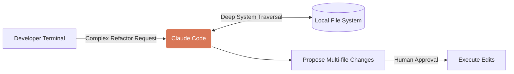

# Claude Code

**Design Philosophy:** Claude Code excels at understanding the interconnectedness of large framework architectures. Use it for major refactoring tasks, such as migrating from Cypress to Playwright, or auditing test coverage across microservices.

## Architecture



## Implementation Standard

Interact with Claude Code using clear, multi-step directives. Rely on its ability to read the file system extensively before writing code.

## Migration Directive Template

Create `docs/claude_migration_directive.md`:

```markdown
# Task: Migrate Authentication Specs to Playwright

**Objective:** Migrate existing Cypress tests in `cypress/e2e/auth/` to the new Playwright framework in `tests/e2e/auth/`.

**Constraints:**
1. **Analyze First:** Review `tests/support/auth_helpers.ts` to understand our custom login fixtures in Playwright before writing any tests.
2. **Translation:** Convert Cypress `cy.get()` calls to appropriate Playwright locators. Avoid direct CSS selectors if semantic locators (roles, text) are viable.
3. **State Management:** Ensure Playwright tests utilize `test.use({ storageState: 'state.json' })` for tests that do not require explicit login flows.
4. **Validation:** Do not consider the migration complete until you have executed the new Playwright spec via the terminal and confirmed it passes.
```
