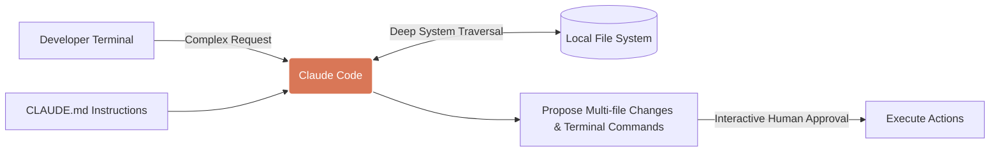

# Claude Code

**Design Philosophy:** Claude Code excels at understanding the interconnectedness of large framework architectures. Use it for major refactoring tasks, such as migrating from Cypress to Playwright, or performing deep repository audits for testing standards.

## Architecture



## The Interactive Permission Model

Unlike stateless APIs, Claude Code acts as a terminal-native agent that pauses and asks for explicit human permission before executing potentially destructive or state-changing terminal commands (e.g., `npm install`, `npx playwright test`, or writing files). This makes it highly safe for QAs to use for exploratory test refactoring.

## Native Context: CLAUDE.md

Claude Code natively looks for a `CLAUDE.md` file in the root of the project to understand workspace rules.

Create `CLAUDE.md`:

```markdown
# QA Rules for Claude Code

1. We use Playwright with TypeScript.
2. All new tests must use `getByRole` or `getByTestId`.
3. Never use `page.waitForTimeout()`.
4. Always ask permission to run `npx playwright test <spec>` after making changes to verify them.
```

## Migration Directive Template

When performing massive migrations, it helps to write a specific markdown file and reference it in your prompt (e.g., "Follow the instructions in docs/claude_migration_directive.md").

Create `docs/claude_migration_directive.md`:

```markdown
# Task: Migrate Authentication Specs to Playwright

**Objective:** Migrate existing Cypress tests in `cypress/e2e/auth/` to the new Playwright framework in `tests/e2e/auth/`.

**Constraints:**
1. **Analyze First:** Review `tests/support/auth_helpers.ts` to understand our custom login fixtures in Playwright before writing any tests.
2. **Translation:** Convert Cypress `cy.get()` calls to appropriate Playwright locators. Avoid direct CSS selectors if semantic locators (roles, text) are viable.
3. **State Management:** Ensure Playwright tests utilize `test.use({ storageState: 'state.json' })` for tests that do not require explicit login flows.
4. **Validation:** Do not consider the migration complete until you have executed the new Playwright spec via the terminal and confirmed it passes.
```

## Use Case: Repository Auditing

Claude Code is exceptional at reading the entire project to find bad patterns.

**Prompt Example:**
> "Audit all files in the `tests/e2e/` directory. Find any test that uses hardcoded `page.waitForTimeout()` sleeps. Replace them with Playwright web-first assertions or explicit waits on network states. Ask for my approval before modifying the files."
