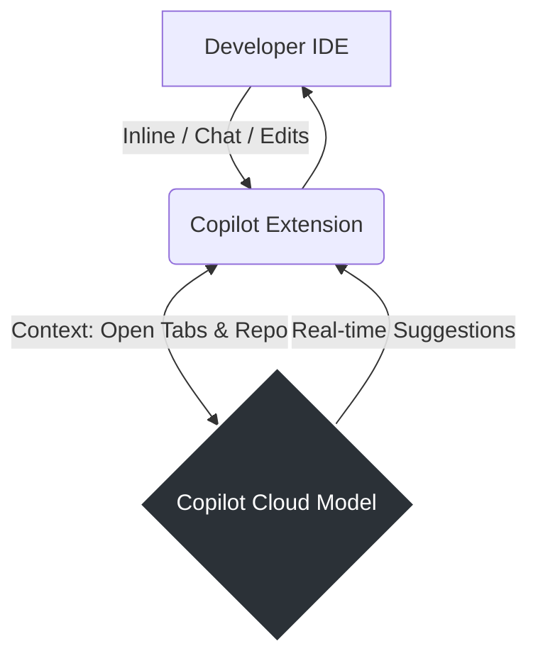

# GitHub Copilot

**Design Philosophy:** Copilot is the "pair programmer" for the SDET. It is highly integrated into the IDE context and is best used for iterative test authoring, querying the codebase, and PR validations.

## Architecture



## Copilot Modes

Understanding the distinct interaction modes is critical for QAs:

1. **Inline Autocomplete:** The traditional real-time code completion. Best used by writing a descriptive comment (e.g., `// Test: User fails to login with invalid password`) and letting Copilot generate the Arrange-Act-Assert block.
2. **Copilot Chat:** The conversational panel. Use `@workspace` to query the repository. (e.g., *"@workspace Where is the Page Object class for the checkout flow?"*)
3. **Copilot Edits / Workspaces:** Agentic features that can propose multi-file changes across the repository, similar to Cursor Composer.

## Context Variables

When using Copilot Chat or Edits, explicitly bound context prevents hallucinations:
- **`#file`:** Reference specific files. Example: *"Update `#login.spec.ts` to use the locators defined in `#LoginPage.ts`."*
- **`@terminal`:** If a test fails in your IDE terminal, you can reference the failure output directly to ask for a fix. Example: *"Analyze the error in `@terminal` and fix the locator in `#checkout.spec.ts`."*

## Native Context: Copilot Instructions

To ensure Copilot adheres to your testing standards across all modes, configure repository-level instructions.

Create `.github/copilot-instructions.md`:

```markdown
# GitHub Copilot Instructions for SDETs

When generating tests or test-related code in this repository:

- **Language/Framework:** Assume Java 17+ and JUnit 5 for backend tests. Assume TypeScript and Playwright for frontend tests.
- **Naming Conventions:** Test methods must follow the `methodName_stateUnderTest_expectedBehavior` convention (e.g., `login_invalidCredentials_throwsUnauthorizedException`).
- **Structure:** Strictly adhere to the Arrange-Act-Assert (AAA) pattern. Use blank lines to separate the three sections within the test method.
- **Data:** Prefer parameterized tests (`@ParameterizedTest` in JUnit) for testing multiple input variations over writing redundant single-case tests.
- **Mocking:** Use Mockito for Java. Use `page.route()` for Playwright network mocking.
```
