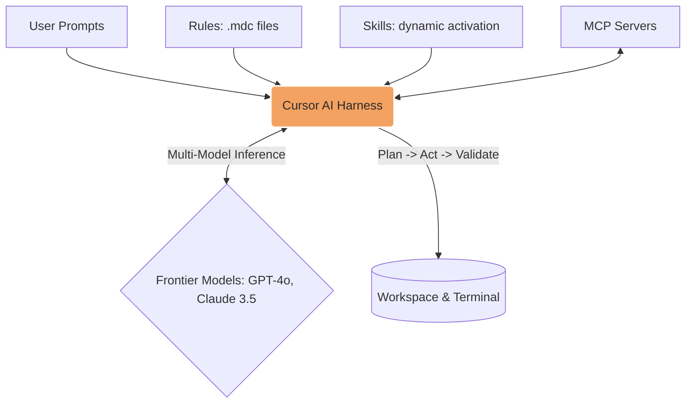

# Cursor

**Design Philosophy:** Cursor is an AI-first IDE designed for high-velocity creation, large-scale refactoring, and agentic workflows. It is the optimal environment for establishing new test repositories, building complex data-generation utilities, running parallel agents for comparative solutions, and delegating QA tasks to cloud agents. 

A central paradigm for SDETs in Cursor is using **Cursor Composer** (`Cmd+I` / `Ctrl+I`) for multi-file scaffolding and refactoring, rather than standard chat.

## Architecture



## Key Concepts

- **Composer** — The multi-file editing interface (`Cmd+I`). Essential for test framework creation.
- **Rules** — Project conventions (`.cursor/rules/*.mdc`) — always or glob-based activation.
- **Skills** — Task-specific workflows (`.cursor/skills/*/SKILL.md`) — dynamic activation.
- **AGENTS.md** — Simple always-on instructions in project root.

## Quick Links

- [Rules System & Hierarchy](/docs/providers/cursor-rules)
- [Specializing Cursor Agents (Skills)](/docs/providers/cursor-skills)
- [MCP Integrations for QA](/docs/providers/cursor-mcp)
- [Composer & Best Practices](/docs/providers/cursor-best-practices)

## Cursor Ignore

Create `.cursorignore`:

```text
# Prevent Cursor from indexing heavy execution artifacts
node_modules/
playwright-report/
test-results/
blob-report/
*.log
.env*
**/cypress/videos/
**/cypress/screenshots/
```
