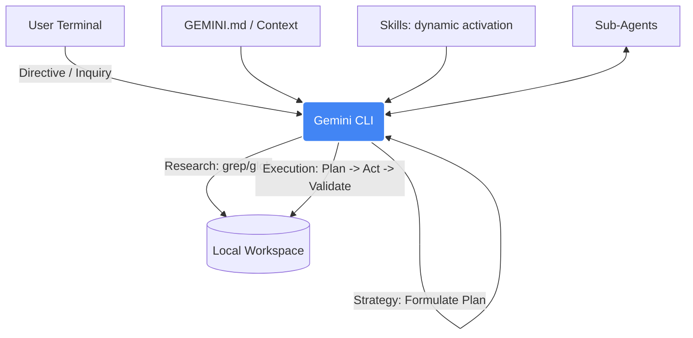

# Gemini CLI

**Design Philosophy:** Gemini CLI acts as your autonomous shell companion. Use it for complex environment setups, rapid test execution via bash, dynamic scaffolding of test suites directly from the terminal, and orchestrating testing architectures using its robust Research → Strategy → Execution loop.

## Architecture



## Key Concepts

- **Context Precedence** — Project instructions defined in `GEMINI.md` override global or extension rules.
- **Skills** — Task-specific workflows dynamically activated via the `activate_skill` tool.
- **Sub-Agents** — Specialized expert agents (e.g., `codebase_investigator`) delegated to via tools.
- **Research → Strategy → Execution** — The core lifecycle ensuring comprehensive planning and strict validation.

## Quick Links

- [Context Management & Hierarchy](/docs/providers/gemini-context)
- [Agent Skills](/docs/providers/gemini-skills)
- [Available Sub-Agents](/docs/providers/gemini-subagents)
- [Workflows & Best Practices](/docs/providers/gemini-best-practices)

## Gemini Ignore

Create `.geminiignore` to protect sensitive test data and configuration files from being read, and improve search speed:

```text
# Exclude heavy execution artifacts and secrets
playwright-report/
test-results/
.env.e2e
cypress/videos/
cypress/screenshots/
node_modules/
```
