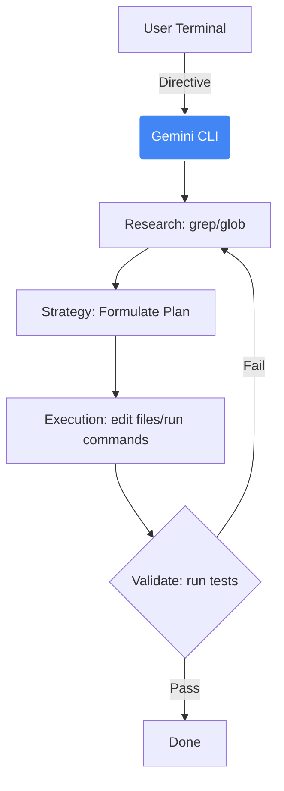

# Gemini CLI

**Design Philosophy:** Gemini CLI acts as your autonomous shell companion. Use it for complex environment setups, rapid test execution via bash, dynamic scaffolding of test suites directly from the terminal, and orchestrating testing architectures using its robust Research → Strategy → Execution loop.

## Architecture



## Implementation Standard

Leverage `.geminiignore` to protect sensitive test data and configuration files from being read. Utilize foundational `GEMINI.md` files to set workspace-wide testing mandates.

## Core Agentic Flows

1. **Research Phase:** Tell the CLI to map the test architecture using `grep_search` and `glob`.
2. **Strategy Phase:** The CLI formulates an execution plan (e.g., refactoring test fixtures) before touching code.
3. **Execution Phase (Plan → Act → Validate):** Ensures that code modifications include tests, are executed natively in the terminal (e.g., `npx playwright test`), and verified against failure states before finishing.

## GEMINI.md Template

```markdown
# QA Workspace Mandates for Gemini CLI

1. **Test Framework:** All new web tests must use Playwright with TypeScript.
2. **Design Pattern:** Strictly adhere to the Page Object Model (POM). Locators must be defined using `page.getByRole()` or `page.getByTestId()` where possible.
3. **Assertions:** Use Playwright's auto-retrying web-first assertions (e.g., `expect(locator).toBeVisible()`). Never use hard `page.waitForTimeout()` sleeps.
4. **Execution:** Before suggesting a code change is complete, you MUST run `npx playwright test <changed_file>` via your `run_shell_command` tool and verify it passes. Never commit untested test specs.
```

## .geminiignore Template

```text
# Exclude test artifacts and secrets
playwright-report/
test-results/
.env.e2e
cypress/videos/
cypress/screenshots/
```

## Sub-Agents & Tools

- **`codebase_investigator`**: Delegate root-cause analysis for flaky tests.
- **`run_shell_command`**: Gemini CLI uses bash directly for spinning up local docker containers or clearing cache before test executions.

## Skills

Create `.gemini/skills/sdet-playwright/SKILL.md` with `<skill_name>`, `<description>`, and `<instructions>` tags. Use the `activate_skill` tool with `skill-creator` to guide Gemini CLI in creating new QA skills.
