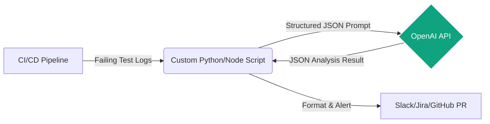

# OpenAI (API/Codex)

**Design Philosophy:** Treat OpenAI models as stateless inference engines within CI/CD pipelines. Best used via custom Python/Node.js scripts to analyze JUnit/Allure reports or generate test data dynamically.

## Architecture



## Implementation Standard

Build microservices or script-based agents that query the API with highly structured JSON schemas.

## QA Log Analyzer Template (Strict Structured Outputs)

Using `strict: true` in the JSON schema guarantees 100% adherence to the structure, which is a mandatory requirement for deterministic CI/CD pipelines so the parsing script never breaks.

Create `prompts/log_analyzer.json`:

```json
{
  "model": "gpt-4o",
  "temperature": 0.1,
  "response_format": {
    "type": "json_schema",
    "json_schema": {
      "name": "test_failure_analysis",
      "strict": true,
      "schema": {
        "type": "object",
        "properties": {
          "failure_type": {
            "type": "string",
            "enum": ["ENVIRONMENT", "LOCATOR_CHANGED", "TIMEOUT", "FLAKY", "BUG"]
          },
          "root_cause_summary": {
            "type": "string"
          },
          "suggested_fix": {
            "type": "string"
          },
          "affected_files": {
            "type": "array",
            "items": { "type": "string" }
          }
        },
        "required": ["failure_type", "root_cause_summary", "suggested_fix", "affected_files"],
        "additionalProperties": false
      }
    }
  },
  "messages": [
    {
      "role": "system",
      "content": "You are a Lead SDET analyzing CI execution logs. Extract failure root causes strictly in the required JSON format."
    }
  ]
}
```
