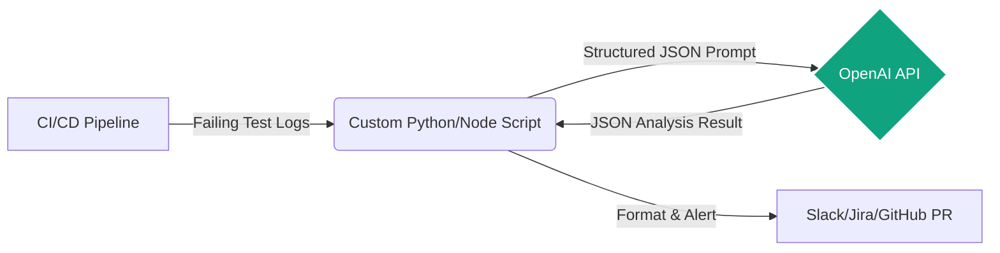

# OpenAI (API/Codex)

**Design Philosophy:** Treat OpenAI models as stateless inference engines within CI/CD pipelines. Best used via custom Python/Node.js scripts to analyze JUnit/Allure reports or generate test data dynamically.

## Architecture



## Implementation Standard

Build microservices or script-based agents that query the API with highly structured JSON schemas.

## QA Log Analyzer Template

Create `prompts/log_analyzer.json`:

```json
{
  "model": "gpt-4-turbo",
  "temperature": 0.1,
  "response_format": { "type": "json_object" },
  "messages": [
    {
      "role": "system",
      "content": "You are a Lead SDET analyzing CI execution logs. Your task is to extract failure root causes. You MUST respond strictly in the following JSON schema: {\"failure_type\": \"ENVIRONMENT|LOCATOR_CHANGED|TIMEOUT|FLAKY|BUG\", \"root_cause_summary\": \"string\", \"suggested_fix\": \"string\", \"affected_files\": [\"string\"]}. Do not include markdown formatting or explanations outside the JSON payload."
    }
  ]
}
```
