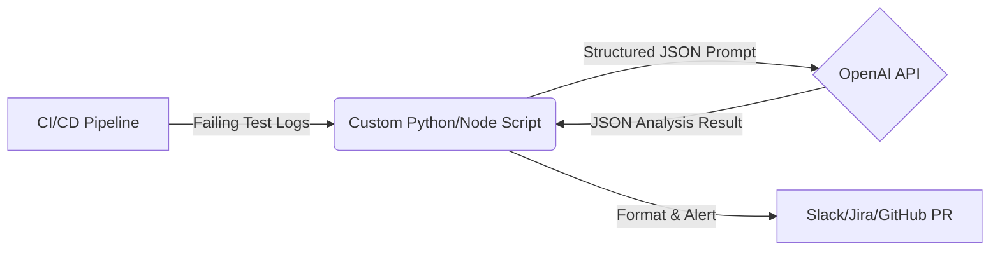

# Tutorial: AI Triage in CI/CD Pipeline

Integrate AI-powered failure analysis into your GitHub Actions workflow.

## Overview

When tests fail in CI, an AI agent analyzes the logs and produces a structured root-cause analysis (failure type, suggested fix, affected files) before the build fails.

## Architecture



## Step 1: Create the AI Triage Script

Create `scripts/ai-triage.js` (or equivalent in Python) that:

1. Reads failure logs from `./test-results/failures.log`
2. Sends a structured prompt to the OpenAI API (see [OpenAI Provider](/docs/providers/openai))
3. Outputs the analysis to the job log or posts to Slack/Jira

## Step 2: Add the GitHub Actions Workflow

Create `.github/workflows/ai_triage.yml`:

```yaml
name: E2E Tests with AI Triage

on: [push, pull_request]

jobs:
  test:
    runs-on: ubuntu-latest
    steps:
      - uses: actions/checkout@v4
      - uses: actions/setup-node@v4
        with:
          node-version: 18
          
      - name: Install dependencies
        run: npm ci
        
      - name: Run Playwright tests
        run: npx playwright test
        id: playwright_execution
        continue-on-error: true # Allow pipeline to continue to triage step
        
      - name: AI Root Cause Analysis
        if: steps.playwright_execution.outcome == 'failure'
        env:
          OPENAI_API_KEY: ${{ secrets.OPENAI_API_KEY }}
        run: |
          node scripts/ai-triage.js ./test-results/failures.log
          
      - name: Fail build if tests failed
        if: steps.playwright_execution.outcome == 'failure'
        run: exit 1
```

## Step 3: Configure Secrets

Add `OPENAI_API_KEY` to your repository secrets (Settings → Secrets and variables → Actions).

## Step 4: Prompt Schema

Use the structured JSON schema from [OpenAI Provider](/docs/providers/openai):

```json
{
  "failure_type": "ENVIRONMENT|LOCATOR_CHANGED|TIMEOUT|FLAKY|BUG",
  "root_cause_summary": "string",
  "suggested_fix": "string",
  "affected_files": ["string"]
}
```

## Next Steps

- [Pipeline Integration Examples](/docs/examples/pipeline-integration)
- [OpenAI Provider Guide](/docs/providers/openai)
